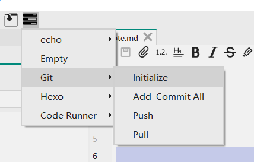

# note
This is a test note.

Just for test tasks.



点击菜单栏的按钮可以执行Task。

调试信息：

 
```
Debug:(task.cpp:53) run task "Initialize" "git init"
Debug:(task.cpp:61) "Initialized empty Git repository in C:/Users/tootal/Documents/Projects/build-vnote-Desktop_Qt_5_12_10_MSVC2017_64bit-Debug/src/.git/\nhint: Using 'master' as the name for the initial branch. This default branch name\nhint: is subject to change. To configure the initial branch name to use in all\nhint: of your new repositories, which will suppress this warning, call:\nhint: \nhint: \tgit config --global init.defaultBranch <name>\nhint: \nhint: Names commonly chosen instead of 'master' are 'main', 'trunk' and\nhint: 'development'. The just-created branch can be renamed via this command:\nhint: \nhint: \tgit branch -m <name>\n"
```

很明显，执行目录不对，先改成当前笔记本的根目录。

算了，赶紧把变量写好。


测试一下含有空格的文件名和文件夹名称。


还有，看能不能让菜单项既可以点击又可以展开。

一点点微小的修改。

啊啊啊啊啊，感觉差不多要好了。


